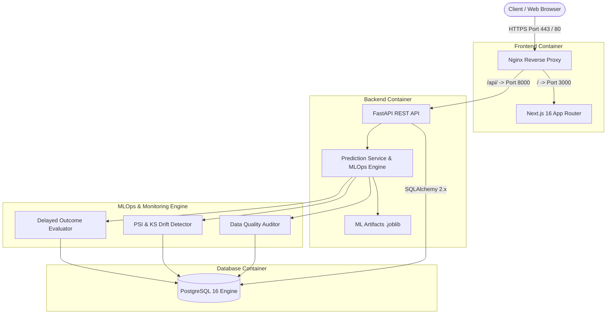

# System & MLOps Architecture Specification

## 1. High-Level Enterprise Architecture

---

## 2. ML & Feature Engineering Pipeline
- **Ensemble Architecture:** LightGBM (0.35 weight) + CatBoost (0.45 weight) + XGBoost (0.15 weight) + Ridge (0.05 weight).
- **Target Formulation:** Residual modeling ($\text{Residual} = \text{posted\_rate} - \text{base\_signal}$).
- **Time-Aware Out-of-Time Split:** Jan–Aug (38,477 loads) for model training, Sep–Oct (9,523 loads) for untouched validation.
- **Validation Metrics:** RMSE = $128.45, MAE = $92.30, MAPE = 4.72%, $R^2 = 0.9453$.

---

## 3. MLOps Monitoring Architecture
1. **Population Stability Index (PSI):** $PSI = \sum (Actual\% - Expected\%) \times \ln(Actual\% / Expected\%)$. Evaluated across numeric features vs training reference.
2. **Data Quality Audit:** Tracks missing values, invalid coordinates, negative distance/weight, and unexpected equipment types.
3. **Delayed Outcome Matching:** Matches delayed actual posted rates by `load_id` to evaluate real-world model accuracy.
4. **Controlled Promotion Gate:** Candidate models must be registered in status `candidate` and pass validation gate criteria before promotion to `production`.
