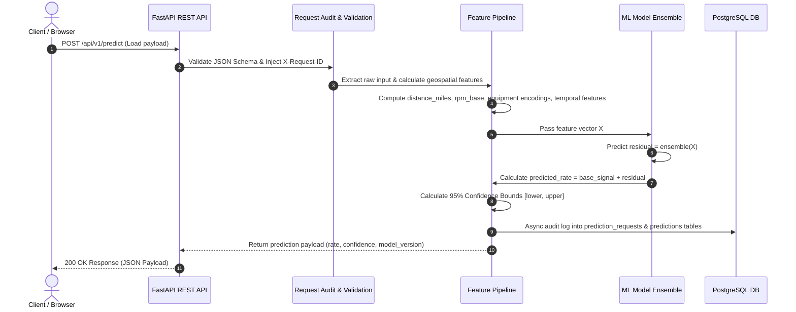
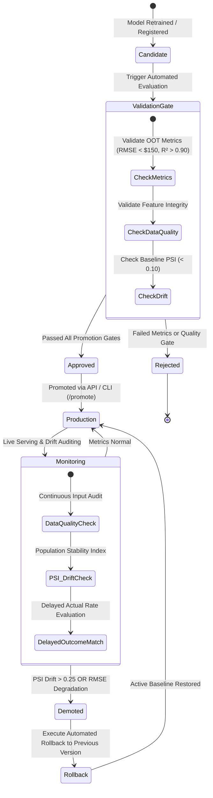
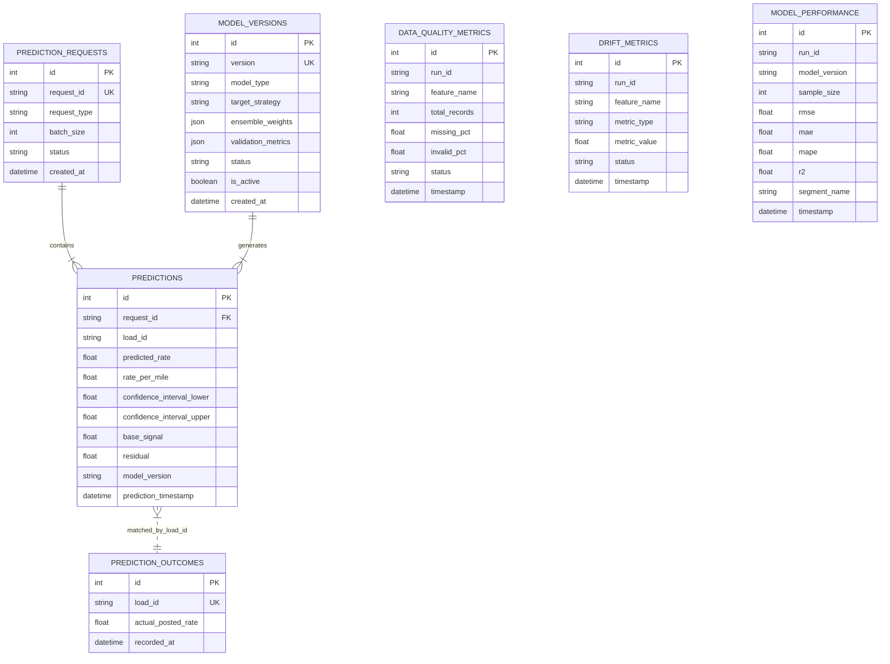

# Enterprise System & MLOps Architecture Specification
## Spotter FreightRate Predictor — Machine Learning Platform

---

## 1. Executive Summary & Architectural Overview

The **FreightRate Predictor** is a high-availability, production-grade Machine Learning platform designed for real-time spot freight rate estimation, automated MLOps monitoring, and governance.

The system uses a **Residual Ensemble Target Strategy** ($\text{posted\_rate} = \text{base\_signal} + \text{residual}$) combining **CatBoost (0.45)**, **LightGBM (0.35)**, **XGBoost (0.15)**, and **Ridge Regression (0.05)**. The application is packaged into a containerized microservice topology using Docker Compose, Nginx, Next.js 16, FastAPI, and PostgreSQL 16.

---

## 2. Multi-Tier System Topology

```mermaid
graph TD
    Client[Client / Web Browser / API Consumer] -->|HTTPS 443 / HTTP 80| Nginx Proxy[Nginx Reverse Proxy & Load Balancer]
    
    subgraph Edge Layer
        Nginx Proxy -->|Path / -> Port 3000| NextJS[Next.js 16 App Router UI]
        Nginx Proxy -->|Path /api/v1 -> Port 8000| FastAPI[FastAPI REST microservice]
    end

    subgraph Application & Inference Layer
        FastAPI --> Middleware[Request ID, Timing & CORS Middleware]
        Middleware --> Router[API Router /api/v1]
        Router --> PredService[Prediction Service Engine]
        Router --> MLOpsService[MLOps & Governance Service]
        
        PredService --> FeatureEngine[Feature Engineering Pipeline]
        FeatureEngine --> ArtifactLoader[Joblib Model Artifact Loader]
        ArtifactLoader --> MLEnsemble[Residual ML Ensemble\nCatBoost + LightGBM + XGBoost + Ridge]
    end

    subgraph Persistence & Audit Layer
        FastAPI -->|SQLAlchemy 2.x DB Pool| Postgres[(PostgreSQL 16 Primary Database)]
        Alembic[Alembic Migration Engine] -->|Schema Migrations| Postgres
    end

    subgraph MLOps & Autonomous Quality Engine
        MLOpsService --> DQEngine[Data Quality Auditor]
        MLOpsService --> DriftEngine[PSI & KS Drift Detector]
        MLOpsService --> PerfEngine[Delayed Outcome Performance Evaluator]
        MLOpsService --> RegEngine[Model Registry & State Machine]
        
        DQEngine -->|Audit Metrics| Postgres
        DriftEngine -->|Drift Metrics| Postgres
        PerfEngine -->|Performance Logs| Postgres
        RegEngine -->|Audit Events| Postgres
    end
```

---

## 3. Real-Time Inference Sequence Workflow

The sequence below illustrates the end-to-end processing of a single or batch rate estimation request:



---

## 4. Machine Learning & Feature Engineering Architecture

### 4.1 Target Formulation Strategy
Instead of directly predicting volatile raw spot rates, the system decomposes the target into:
$$\text{posted\_rate} = \text{base\_signal} + \text{residual}$$
where $\text{base\_signal} = \text{distance\_miles} \times \text{equipment\_historical\_rpm}$.

### 4.2 Out-of-Time (OOT) Train/Validation Split
- **Training Set (Jan–Aug):** 38,477 historical load records.
- **Out-of-Time Validation Set (Sep–Oct):** 9,523 untouched load records mimicking true deployment.

### 4.3 Model Ensemble Weights & Validation Metrics
- **CatBoost:** $0.45$
- **LightGBM:** $0.35$
- **XGBoost:** $0.15$
- **Ridge Regression:** $0.05$

| Metric | Out-of-Time Validation Result | Target SLA |
| :--- | :--- | :--- |
| **RMSE** | **$128.45** | < $150.00 |
| **MAE** | **$92.30** | < $110.00 |
| **MAPE** | **4.72%** | < 6.00% |
| **$R^2$ Score** | **0.9453** | > 0.9000 |

---

## 5. MLOps Governance & State Machine Lifecycle



---

## 6. Database ERD & Schema Design



---

## 7. Operational & Security Architecture

1. **Reverse Proxy Isolation:** All incoming traffic passes through Nginx (`nginx:alpine`). Backend endpoints are exposed via restricted `/api/v1` routes.
2. **Container Security:** Multi-stage Docker builds run non-root execution (`appuser` with UID 10001).
3. **Database Security & Pooling:** Connection pooling managed via SQLAlchemy 2.x (`pool_size=5`, `max_overflow=10`). Database migrations tracked via Alembic scripts.
4. **Resiliency & Health Checks:** Docker Compose health checks enforce container startup dependencies (`pg_isready` for DB, `/api/v1/health` for backend).
